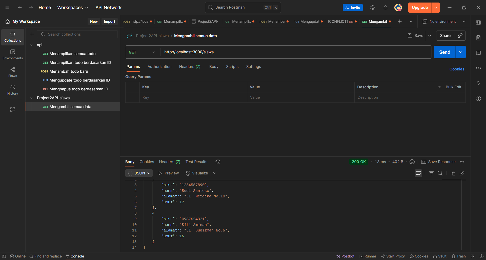
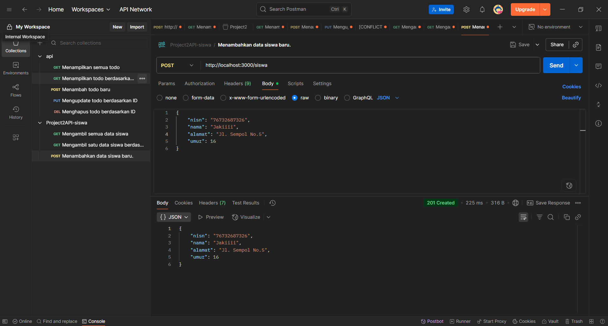
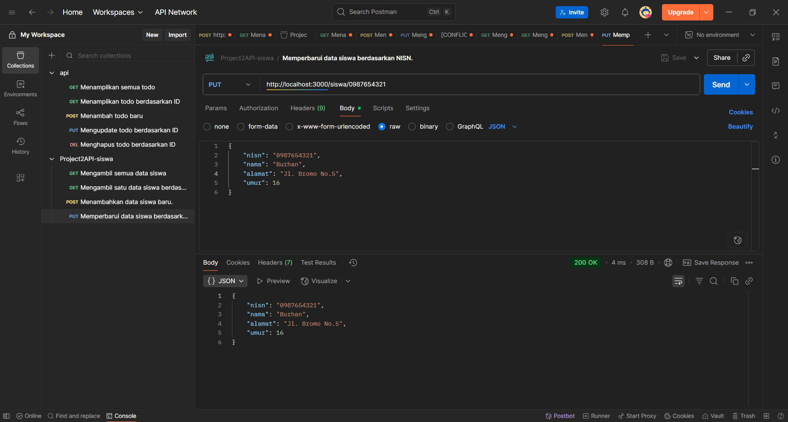
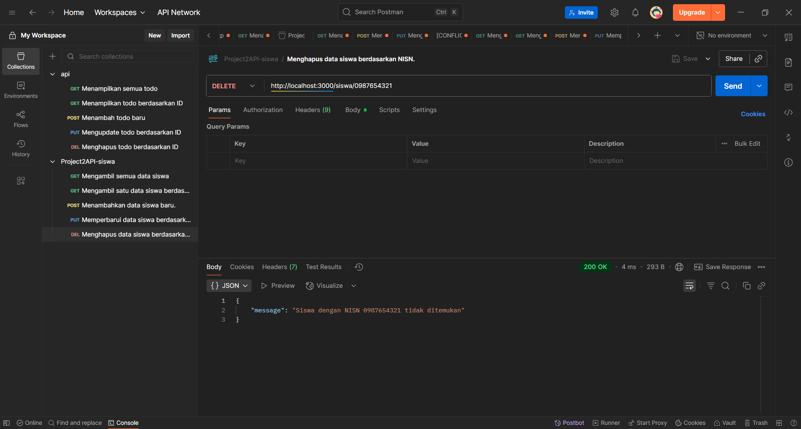

# 📝 NestJS In-Memory Todo API

<p align="center">
  <a href="https://nestjs.com/" target="_blank">
    
  </a>
</p>

## 📋 Deskripsi Proyek

Ini adalah implementasi **RESTful API** sederhana untuk menyimpan data siswa yang dibuat menggunakan **NestJS**. Proyek ini dirancang khusus untuk memenuhi tugas sekolah, di mana data tidak disimpan dalam database, melainkan di dalam sebuah array yang ada di memori. Tujuannya adalah untuk mendalami konsep **Routing** dan **CRUD (Create, Read, Update, Delete)** di NestJS, serta mempraktikkannya menggunakan Postman.

---

## 👤 Identitas Siswa

- **Nama:** Mochammad Dzaky Azzam
- **Kelas:** XI RPL 1
- **Presensi:** 28

---

## ✨ Fitur dan Endpoint

Struktur data siswa:

```json
{
  "id": number,
  "title": string,
  "status": string
}
````

Berikut adalah daftar endpoint yang tersedia:

| Metode       | Endpoint       | Deskripsi                                   |
| :----------- | :------------- | :------------------------------------------ |
| **`GET`**    | `/siswa`       | Mengambil semua data siswa.                 |
| **`GET`**    | `/siswa/:nisn` | Mengambil satu data siswa berdasarkan NISN. |
| **`POST`**   | `/siswa`       | Menambahkan data siswa baru.                |
| **`PUT`**    | `/siswa/:nisn` | Memperbarui data siswa berdasarkan NISN.    |
| **`DELETE`** | `/siswa/:nisn` | Menghapus data siswa berdasarkan NISN.      |

-----

## 🛠️ Cara Menjalankan Proyek

1.  **Clone repositori ini:**

    ```bash
    git clone https://github.com/username/API-project2.git
    ```

2.  **Masuk ke direktori proyek:**

    ```bash
    cd [API-project2]
    ```

3.  **Instal semua dependensi:**

    ```bash
    npm install
    ```

4.  **Jalankan aplikasi dalam mode pengembangan:**

    ```bash
    npm run start:dev
    ```

    API akan berjalan secara default di `http://localhost:3000`.

-----

## 📷 Dokumentasi Pengujian (Postman)

Berikut adalah hasil pengujian setiap endpoint menggunakan **Postman** yang menunjukkan fungsionalitas CRUD.

<br>

**1. GET Semua Siswa (`GET /siswa`)**


**2. GET Siswa Berdasarkan NISN (`GET /siswa/:nisn`)**


**3. POST Tambah Siswa (`POST /siswa`)**


**4. PUT Update Siswa (`PUT /siswa/:nisn`)**


**5. DELETE Siswa (`DELETE /siswa/:nisn`)**
